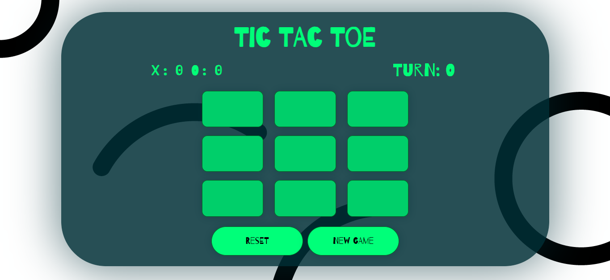

# 🎮 Tic Tac Toe Web Game

A fun, responsive, and interactive web-based Tic Tac Toe game built using **HTML**, **CSS**, and **JavaScript** — complete with sound effects and win tracking!

---

## 📸 Demo

 

---

## 🚀 Features

- 🔁 Two-player mode with alternating turns (X vs O)
- 🏆 Win tracker for X and O
- 🥳 Animated win/tie messages
- 🎵 Sound effects on moves, wins, ties, and resets
- 🎨 Stylish, responsive UI using custom CSS
- 📱 Mobile-friendly layout

---

## 📁 Project Structure

├── index.html          # Main HTML structure
├── styles.css          # All styles and responsive design
├── app.js              # Game logic and interactivity
└── media/
├── img/
│   └── squiggles\_and\_doodles\_background.jpg
└── audio/
├── mixkit-message-pop-alert-2354.mp3
├── level-up-05-326133.mp3
├── mixkit-long-pop-2358.wav
└── sadwhisle-91469.mp3

---

## 🧠 How to Play

1. Open `index.html` in a browser.
2. Click on any box to place `O` or `X`.
3. The game will detect a winner or tie automatically.
4. Use the **Reset** button to restart the current game.
5. Use **New Game** to reset the board and win counters.

---

## ⚙️ Setup Instructions

1. Clone or download this repository.
2. Make sure the `media/` folder (with audio and image assets) is in the root directory.
3. Open `index.html` in any modern browser.

---

## 📦 Dependencies

- Pure **HTML5, CSS3, and JavaScript**
- Fonts from [Google Fonts](https://fonts.google.com):
  - Barrio
  - Doto
  - Major Mono Display

---

## 📱 Responsive Design

The game adjusts layout for:
- Tablets (under 900px width)
- Mobile phones (under 400px width)
- Small screen heights (under 600px height)

---

## 📜 License

MIT License — feel free to use, modify, and distribute!

---

## 💡 Credits

- Sound effects: [Mixkit](https://mixkit.co/) & [Pixabay](https://pixabay.com/)
- Background image: squiggles_and_doodles (your own or from a free source)

---

## 🙌 Contribution

Want to improve the game? Add AI mode, animations, or online multiplayer — feel free to fork and contribute!
